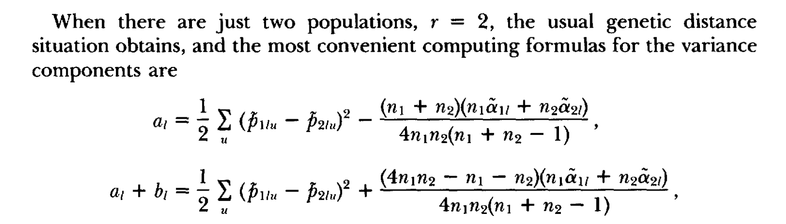

# Estimate window FST and nucleotide diversity between two populations simulated under neutral demographic models
This analysis estimate window FST and nucleotide diversity between two populations evolved under neutral demographic models from ms simulation. The estimated FST and diversity will serve as a sanity check for the ms simulation, which will be later used as a reference of neutral FST distribution for QST-FST comparison.

## Output
* A [summary file](data/estimate_fst_diversity.report) contains mean FST and nucleotide diversity across neutral windows
* A one-column table of estimated window-FST ([example](data/fst_chr2R_5_pop.txt)), where each row is a window
* A one-column table of estimated nucleotide diversity for each population ([example](data/diversity_chrX_6_pop_ZI.txt)), where each row is a window

No input files needed for ms simulation     

## Method step-by-step
1. Simulate the genotype data of 100,000 independent windows (i.e. segments) of 5000 bp evolved under neutral demographic models, using ms ([code](code/ms_simulation_window.sh)).

    The simulation parameters for ms are mainly borrowed from [da Silva Ribeiro et al 2022](https://doi.org/10.1093/gbe/evac143) ([Supplementary table S2](https://academic.oup.com/gbe/article/14/10/evac143/6713900#supplementary-data)). 
    
    Compared to ms simulation models used in [da Silva Ribeiro et al 2022](https://doi.org/10.1093/gbe/evac143), I made the following changes to ms parameters:
    * Number of copies of the locus in each sample: set to 18, because our experimental sample structure for each population is: 6 crosses x 2 strain per cross x 150% (because of the ~50% remaining heterozygosity in each strain)
        ```
        sample_size=18   # Sample size for each population
        number_samples=$((2*$sample_size))   # Number of copies of the locus in each sample.
        ```
    * Number of independent replicates: equivalent to the number of independent SNPs being simulated.
        ```
        number_reps=100000
        ```
    * Population Structure: the used parameters refer to: 6 populations, sample sizes (not the population size!) for each population (here ZI, RG, CO, EA, EG, and FR) being 18, 0, 0, 0, 0, 18, and migration rate = 0. The total sample size across populations = 36 (number_samples).
        ```
        popstr="-I 6 18 0 0 0 0 18 0"
        ```
    *  Number of sites in the simulated fragment. This number is not specified as a parameter in the ms command, but is later used as a multiplier to theta
        ```
        non_parametric_num_site=5000
        ```
    The population-level mutation rate (theta) is calculated as per-site mutation rate (same as the per-base mutation rate used in Tiago paper) multiplied by the number of sites. E.g., when number of sites=5000, a random number of mutations are simulated across a segment of 5000 bp. Since recombination does not affect nucpleotide diversity, we don't need to set the recombination parameter '-r'.
    ```
    mutation_params=("-t $(echo "0.006931286816*$non_parametric_num_site" | bc)" \
    "-t $(echo "0.007825323409*$non_parametric_num_site" | bc)" \
    "-t $(echo "0.007709097286*$non_parametric_num_site" | bc)"
    )   # Population-level mutation rate (theta), 
    ```

    The demographic parameters remains unchanged, for example:
    * Demographic parameters including: population size changes (-en), migration rate changes (-em), population mergers (-ej). These parameters are chromosome-specific, and are copied from the parameter setting of a six-population Drosophila model for X chromosome ("Northern - X (6 Pop)") from [da Silva Ribeiro et al 2022](https://doi.org/10.1093/gbe/evac143).
        ```
        other_demo_params="-en 0 1 3.173337227 -en 0 2 1.744557454 -en 0 3 1.567815653 -en 0 4 1.092572221 -en 0 5 0.104324432 -en 0 6 0.343941249 -em 0 1 2 2.13E+01 -em 0 2 1 2.13E+01 -em 0 1 3 6.20E-04 -em 0 3 1 6.20E-04 -em 0 1 4 0 -em 0 4 1 0 -em 0 1 5 0 -em 0 5 1 0 -em 0 1 6 0 -em 0 6 1 0 -em 0 2 3 1.30E+01 -em 0 3 2 1.30E+01 -em 0 2 4 1.74E+01 -em 0 4 2 1.74E+01 -em 0 2 5 4.18E+00 -em 0 5 2 4.18E+00 -em 0 2 6 0 -em 0 6 2 0 -em 0 3 4 6.90E-02 -em 0 4 3 6.90E-02 -em 0 3 5 2.96E-01 -em 0 5 3 2.96E-01 -em 0 3 6 0 -em 0 6 3 0 -em 0 4 5 5.83E-02 -em 0 5 4 5.83E-02 -em 0 4 6 0 -em 0 6 4 0 -em 0 5 6 3.38E+01 -em 0 6 5 3.38E+01 -ej 0.007661707 6 5 -en 0.007661707001 5 0.054085732 -em 0.007661707001 1 2 2.13E+01 -em 0.007661707001 2 1 2.13E+01 -em 0.007661707001 1 3 6.20E-04 -em 0.007661707001 3 1 6.20E-04 -em 0.007661707001 1 4 0 -em 0.007661707001 4 1 0 -em 0.007661707001 1 5 0 -em 0.007661707001 5 1 0 -em 0.007661707001 2 3 1.30E+01 -em 0.007661707001 3 2 1.30E+01 -em 0.007661707001 2 4 1.74E+01 -em 0.007661707001 4 2 1.74E+01 -em 0.007661707001 2 5 3.36E+00 -em 0.007661707001 5 2 3.36E+00 -em 0.007661707001 3 4 6.90E-02 -em 0.007661707001 4 3 6.90E-02 -em 0.007661707001 3 5 3.37E+00 -em 0.007661707001 5 3 3.37E+00 -em 0.007661707001 4 5 4.00E+00 -em 0.007661707001 5 4 4.00E+00 -ej 0.037301481 4 3 -en 0.037301481001 3 0.077431613 -em 0.037301481001 1 2 2.13E+01 -em 0.037301481001 2 1 2.13E+01 -em 0.037301481001 1 3 4.44E-03 -em 0.037301481001 3 1 4.44E-03 -em 0.037301481001 1 5 0 -em 0.037301481001 5 1 0 -em 0.037301481001 2 3 5.65E-03 -em 0.037301481001 3 2 5.65E-03 -em 0.037301481001 2 5 3.36E+00 -em 0.037301481001 5 2 3.36E+00 -em 0.037301481001 3 5 1.15E-03 -em 0.037301481001 5 3 1.15E-03 -ej 0.051883961 5 3 -en 0.051883961001 3 0.106814972 -em 0.051883961001 1 2 2.13E+01 -em 0.051883961001 2 1 2.13E+01 -em 0.051883961001 1 3 1.14E-01 -em 0.051883961001 3 1 1.14E-01 -em 0.051883961001 2 3 1.59E+00 -em 0.051883961001 3 2 1.59E+00 -ej 0.053704749 3 2 -en 0.053704749001 2 0.600038179 -em 0.053704749001 1 2 4.97E-02 -em 0.053704749001 2 1 4.97E-02 -ej 0.054821003 1 2 -en 0.054821003 2 1.650830153 -en 0.286350238 2 1"
        ```
    Taken together, the [ms command](code/ms_simulation_window.sh#L27) looks like:
    ```
    ms $number_samples $number_reps $mutation_param $popstr $other_demo_param > simulated_genotype_data.txt
    ```

    Output:     
    a standard [ms](https://snoweye.github.io/phyclust/document/msdoc.pdf) output that contains genotype matrix across simulated populations for one chromosomal arm ([example](data/ms_simulation_chr2R_5_pop.txt)).
2. Convert each ms output to:
    *  a genotype count table (.ct), where each row is a segregating site. The first column represents the number of ancestral allele, and the second column is the number of the derived allele. 
    *  a window information file (.win), where each row records the number of segregating sites within each window (of a pre-defined length, e.g., 5000 bp)
    
    This is done by calling a [python script](code/convert_ms_to_count_tables_window.py) from a [shell script](code/convert_ms_to_ct_table_window.sh). 
3. Estimate FST (Reynolds estimator) and nucleotide diversity between the two focal populations (here ZI and FR) for each window, with the following steps:
    1. Extract allele frequency for each segregating site in each population from the genotype count table
    2. Apply a modified version of my [Reynolds FST estimator](https://github.com/Sfeng666/Dsuz_popgen_GEA/blob/main/genetic_diff/Fst/code/calc_Fst_reynolds_ungapped_efs.py#L106-L131) to the extracted allele frequency and pre-defined sample size to calculate the numerator and denominator of per-site FST.
    3. Calculate window-FST as the weighted average of per-site FST numerator and denominators across segregating sites of each window (using .win files as input).
    4. Calculate nucleotide diversity of each window (using the actual window size as the demoninator!) as (total heterozygosity across segregating sites)/(window length).

    This is done by calling a [python script](code/code/calc_snp_fst_reynolds_from_ct_window.py) from a [shell script](code/code/calc_snp_fst_reynolds_from_ct_window.sh#L4-L22). 
4. Calculate the mean FST and nucleotide diversity across all windows for sanity check ([code](code/calc_snp_fst_reynolds_from_ct_window.sh#L24-L32))
5. (optional & follow-up) Compare the calculated FST and nucleotide diversity to empirical and simulated results on the same models from [Sprengelmeyer et al 2020](https://doi.org/10.1093/molbev/msz271) (Table S4).
6. (optional & follow-up) Plot the distribution of window- and SNP-FST ([example](data/fst_distribution_chrX_6_pop_simulated.png)) with 95% and 90% percentiles calculated, and subsample 1000 SNPs from the lower 95% of SNP-FST distribution for following power analysis of QST estimation ([code](code/plot_fst_distribution.Rmd)).
    * be aware that the subsampled 'neutral' QST can be adaptive, too

## Note
1. As confirmed by a personal communication with one of the authors of [Reynolds et al 1983](https://doi.org/10.1093/genetics/105.3.767), the sample size n1, n2 implemented in the below formula of Reynolds' FST estimator should be diploid individual sample size. A correction is made on this in my most updated [script](code/calc_snp_fst_reynolds_from_ct_window.py#L18-L20). Plug-in haploid sample size as n1 and n2 would lead to a slightly inflated FST (see [a previous result doing that](data/estimate_fst_diversity.report.prev_2xspsize)), when the sample sizes are small (e.g., mean FST inflated by 0.02 when n1=n2=18); the bias become trivial when sample sizes get larger.
     
2. In addition to window-FST, SNP-FST ([summary table](data/estimate_fst_snp.report)) are also calculated for simulation data (using a [python](code/calc_snp_fst_reynolds_from_ct_snp.py) and [shell](code/calc_snp_fst_reynolds_from_ct_snp.sh) script), so that the simulated FST is more comparable for SNP-FST (cannot do window FST) estimated from empirical data.
3. In calculation of FST, we assumed that the ancestral and derived allele in population 1 and 2 are the same alleles. 
4. Be careful about bandwidth used for plotting distribution! The default bandwidth of the distribution-plotting function ggplot2::geom_density() is <u>heuristically determined</u> as a function of: (1) standard deviation of the data, (2) interquartile range of the data, and (3) number of data points. 
    * Default calculation of bw:  $\text{bw} = 0.9 \times \min(\text{sd}, \text{IQR}/1.34) \times n^{-1/5}$
    * Since chromosome arms do differ in number of sites and standard deviation (of MAF and/or FST), the default bandwidth used is different across input data. 
    * Specifically, a wider band width has over-smoothed distribution of chromosomes with less empirical sites (e.g., chrX) compared to chromosomes with more empirical sites (e.g., chr2R, chr3L) or much more (~4 magnitudes higher) simulated sites.
    * For a fair comparison across distributions, I now use a fixed bandwidth bw = 0.01 across all FST distributions.
5. It's hard to justify for exclude the singleton SNPs that has Reynolds & Weir' FST of 0.
    * possible to substract a number of singleton SNPs based on sequencing error rate (1.36*e-5 * number of genomes). Although that may not contribute significantly to the huge proportion of singletons we currently have.

## Environment setup
To set up the environment for this analyses, you could use conda:
```
conda env create -n qst_fst_sim --file env/qst_fst_sim.yml
```

If you have not installed conda, run the following command:
```
# download miniconda
curl -sL \
  "https://repo.anaconda.com/miniconda/Miniconda3-latest-Linux-x86_64.sh" > \
  "Miniconda3.sh"
```
```  
# install miniconda
bash Miniconda3.sh
```


